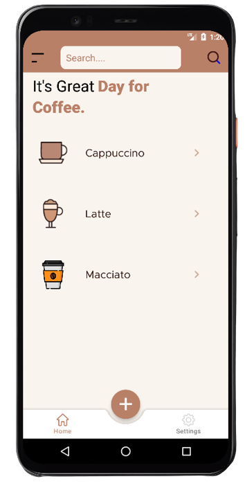
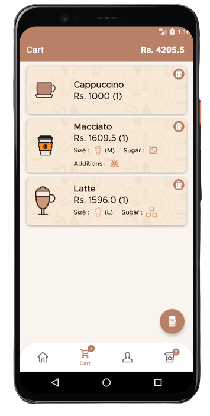

# CoffeOrderApp
CoffeOrderApp.Threr was two users.Anmin & User.

 ## Splash_Screen

 ## Welcome_Screen

 ## Register_Screen

 ## ForgotPass_Screen

 ## Login_Screen

 ## Admin_Home_Screen

 ## Admin_add_coffee_Screen

 ## Admin_update_coffee_Screen

 ## Admin_Edit_coffee_Screen

 ## User_Home_Screen

 ## User_Coffee_Detail_Screen

 ## User_Coffee_Cart_Screen

 ## User_Profile_Screen

 ## User_Mobile_Verify_Screen

 ## User_Show_Orders_Screen

 ## User_Show_Order_Details_Screen

